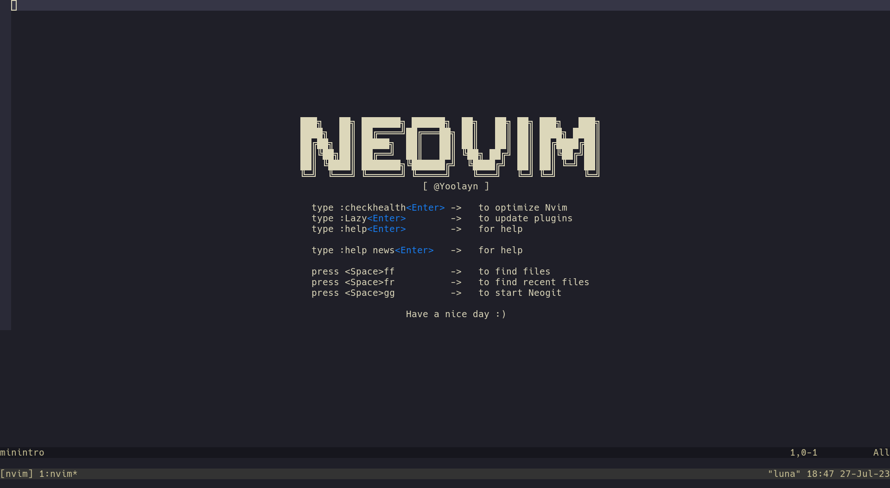

# NOTICE

Mirror of [nvim-intro](https://github.com/Yoolayn/nvim-intro), originally
released under the MIT Licence by [Julian Jaroszynski](https://github.com/Yoolayn).

# nvim-intro
Replacer for default Intro in neovim

## Motivation
Neovim intro screen can be extremely buggy and forced to close automatically by plugins installed such as
[nvim-tree](https://github.com/nvim-tree/nvim-tree.lua),
[bufferline](https://github.com/akinsho/bufferline.nvim),
[lualine](https://github.com/nvim-lualine/lualine.nvim) and many more.
`nvim-intro` hijects `no-name` and `directory` buffer and draws a simple intro logo.
I tried to emulate the function of the original Intro as much as I could. If
you have any improvements feel free to make a pull request.
Thanks to the [original author](https://github.com/eoh-bse/minintro.nvim)
for making most of the plugin.

## Screenshot


## Installation
```lua
-- Lazy
{
    "Yoolayn/nvim-intro",
    config = true,
    lazy = false
}
```

```lua
-- Packer
use {
    "Yoolayn/nvim-intro",
    config = function() require("nvim-intro").setup() end
}
```

## Configuration
You can customize the intro logo(adding your own will overwrite the default one).
It is possible to change it's color, make a scratch buffer appear at the start
instead of a regular one. You can use highlight parts of the logo with custom color by setting
[pattern] = color
you can also use callback to specify a custom function that can be run on the logo screen, keep in mind that if it changes buffer/window the intro will disappear!
Please keep all the lines in the intro option the same length, as it may cause unexpected results.

minintro comes with these defaults:
```lua
-- Lazy
{
    "Yoolayn/nvim-intro",
    opts = {
        intro = {
            " ███╗   ██╗ ███████╗ ██████╗  ██╗   ██╗ ██╗ ███╗   ███╗",
            " ████╗  ██║ ██╔════╝██╔═══██╗ ██║   ██║ ██║ ████╗ ████║",
            " ██╔██╗ ██║ █████╗  ██║   ██║ ██║   ██║ ██║ ██╔████╔██║",
            " ██║╚██╗██║ ██╔══╝  ██║   ██║ ╚██╗ ██╔╝ ██║ ██║╚██╔╝██║",
            " ██║ ╚████║ ███████╗╚██████╔╝  ╚████╔╝  ██║ ██║ ╚═╝ ██║",
            " ╚═╝  ╚═══╝ ╚══════╝ ╚═════╝    ╚═══╝   ╚═╝ ╚═╝     ╚═╝",
        },
        color = "#98c379",
        scratch = false,
    }
    lazy = false
}
```

```lua
-- Packer
use {
    "Yoolayn/nvim-intro",
    config = function() require("nvim-intro").setup({
        intro = {
            " ███╗   ██╗ ███████╗ ██████╗  ██╗   ██╗ ██╗ ███╗   ███╗",
            " ████╗  ██║ ██╔════╝██╔═══██╗ ██║   ██║ ██║ ████╗ ████║",
            " ██╔██╗ ██║ █████╗  ██║   ██║ ██║   ██║ ██║ ██╔████╔██║",
            " ██║╚██╗██║ ██╔══╝  ██║   ██║ ╚██╗ ██╔╝ ██║ ██║╚██╔╝██║",
            " ██║ ╚████║ ███████╗╚██████╔╝  ╚████╔╝  ██║ ██║ ╚═╝ ██║",
            " ╚═╝  ╚═══╝ ╚══════╝ ╚═════╝    ╚═══╝   ╚═╝ ╚═╝     ╚═╝",
        },
        color = "#98c379",
        scratch = false,
    }) end
}
```

## Example
this is my configuration from the screenshot, using lazy.nvim
```lua
    return {
        "Yoolayn/nvim-intro",
        config = {
            intro = {
                "███╗   ██╗ ███████╗ ██████╗  ██╗   ██╗ ██╗ ███╗   ███╗",
                "████╗  ██║ ██╔════╝██╔═══██╗ ██║   ██║ ██║ ████╗ ████║",
                "██╔██╗ ██║ █████╗  ██║   ██║ ██║   ██║ ██║ ██╔████╔██║",
                "██║╚██╗██║ ██╔══╝  ██║   ██║ ╚██╗ ██╔╝ ██║ ██║╚██╔╝██║",
                "██║ ╚████║ ███████╗╚██████╔╝  ╚████╔╝  ██║ ██║ ╚═╝ ██║",
                "╚═╝  ╚═══╝ ╚══════╝ ╚═════╝    ╚═══╝   ╚═╝ ╚═╝     ╚═╝",
                "                      [ @Yoolayn ]                    ",
                "                                                      ",
                "  type :checkhealth<Enter> ->   to optimize Nvim      ",
                "  type :Lazy<Enter>        ->   to update plugins     ",
                "  type :help<Enter>        ->   for help              ",
                "                                                      ",
                "  type :help news<Enter>   ->   for help              ",
                "                                                      ",
                "  press <Space>ff          ->   to find files         ",
                "  press <Space>fr          ->   to find recent files  ",
                "  press <Space>gg          ->   to start Neogit       ",
                "                                                      ",
                "                   Have a nice day :)                 ",
            },
            color = "#f7f3f2",
            scratch = true,
            highlights = {
                ["<Enter>"] = "#187df0",
            }
        },
    },
```

## Things to be aware of
If you have some sort of `tabline` plugin such as [bufferline](https://github.com/akinsho/bufferline.nvim),
`vim.opt.showtabline` will be overridden to `1`. This forces display of a buffer tab even when there is only
one. If you do not wanna see the tab, you can modify `bufferline`'s configuration like the following:
```lua
require("bufferline").setup({
    options = {
        always_show_bufferline = false
    }
```
The above configuration will effectively set `vim.opt.showtabline` to 2, meaning the tabs will only start to
display when there is more than one buffer open

## Notice
nvim-intro will throw an error when lazy.nvim starts and updates something, but after a restart should be working as normal

